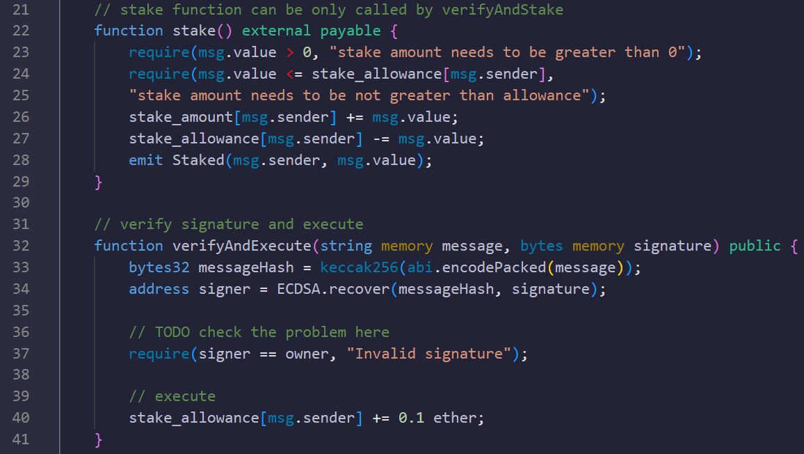
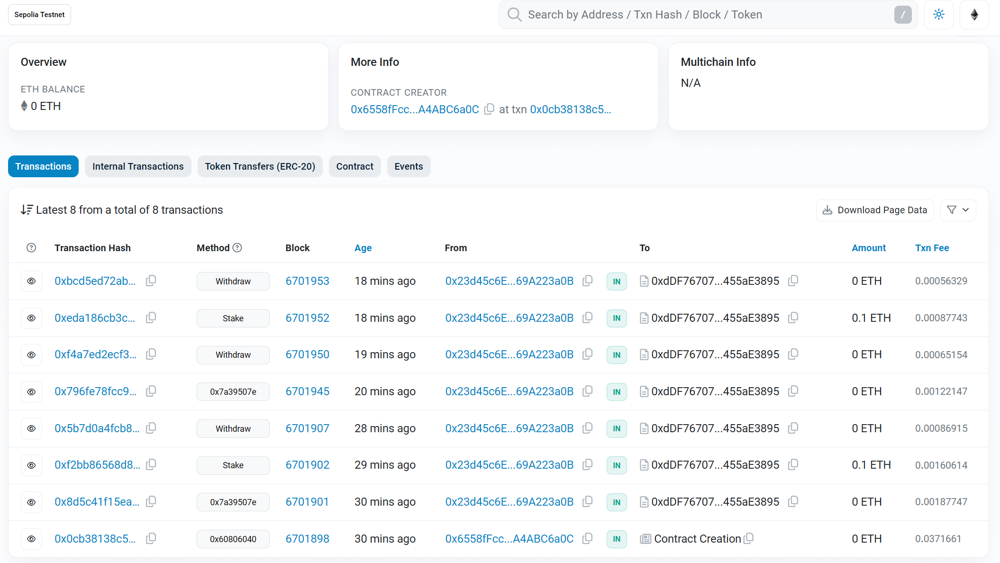
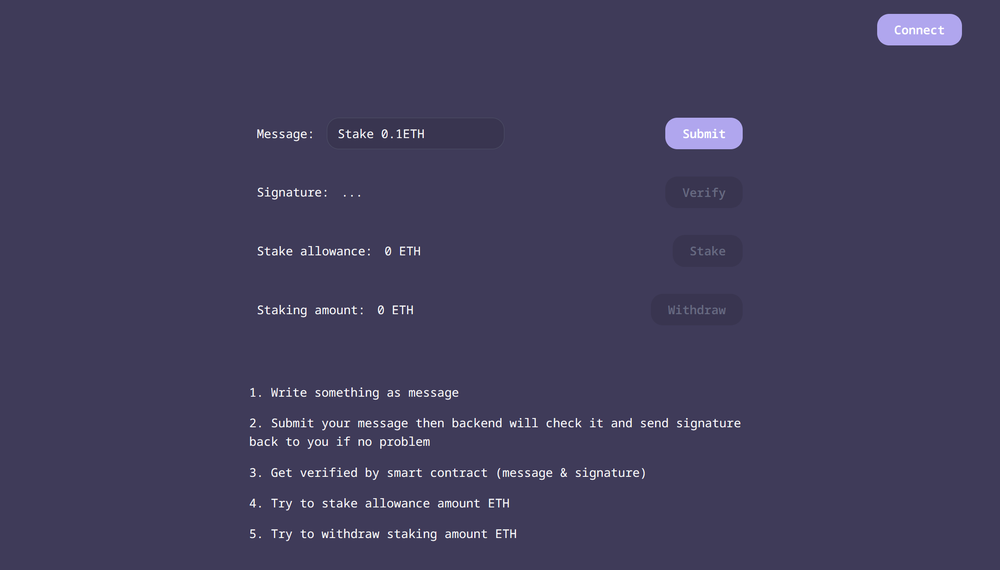

# stake-dapp
dapp individual assignment


Install command:

```
npm install
```


Run command:

```
npm run dev
```


> Stake DApp with Off-chain Signature Verify Function
>
> 具有链下签名与验证功能的质押DApp


\- Frontend: React, Typescript, Web3.js, @web3-react

\- Backend: Python (Flask)

\- Blockchain Platform: Sepolia

\- Smart Contract Language: Solidity

\- Cloud Services: Vercel [stake-dapp-eosin.vercel.app](https://stake-dapp-eosin.vercel.app/)

\- API Integration: Infura


> ECDSA.recover from OpenZepellin




> Sepolia transactions https://sepolia.etherscan.io/address/0xddf7670719e77c54567ab95a20a4b4a455ae3895




> Stake DApp UI


